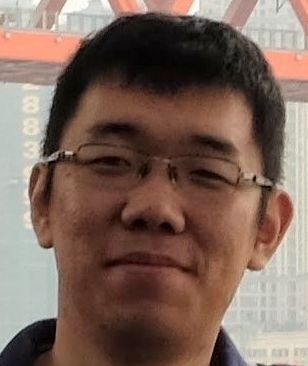
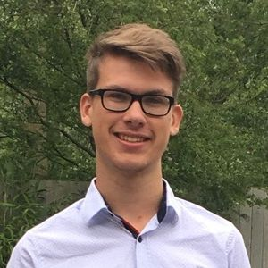

# CSE1105 #GoGreen-group82

# **About our Project** :

### **Name :** 
Project #GoGreen
	
### **Our goal:** 
Environmental issues are harmful effects of human activity on the biophysical environment. Environmental protection is a practice of protecting the natural environment on individual, organizational or governmental levels, for the benefit of both the environment and humans. Our project is focused on each individual person and especially on the ecological footprint per person, as its level in the Netherlands is particularly high. We are building Java application that enables users to enter their ecological choices. They get an overview of what they can do and see how much greener they can still go. To stimulate more green activities, we are integrating a gamification aspect to the application. Through it the users will be able to compare their progress with their friends. Based on your score and your achievements you will be placed in a rank group, which differentiate from each other on specially created badges.

---

### Environment

java 11.0.2

Maven 3.6.0

### Structure

```po

├── CSE1105.checkstyle.xml
├── LICENSE
├── README.md
├── gogreen-client
│   ├── gogreen-client.iml
│   ├── pom.xml
│   ├── src
│       ├── main
│       │   ├── java
│       │   │   └── gogreenclient
│       │   │       ├── GoGreenApplication.java
│       │   │       ├── config
│       │   │       ├── datamodel
│       │   │       └── screens
│       │   │           └── window
│       │   └── resources
│       │       ├── application.yml
│       │       ├── identity.jks
│       │       ├── static
│       │       ├── truststore.jks
│       │       └── views
│       └── test
│           └── java
│               └── gogreenclient
│                   ├── GoGreenApplicationTest.java
│                   └── datamodel
├── gogreen-webserver
│   ├── gogreen-webserver.iml
│   ├── pom.xml
│   ├── src
│       ├── main
│       │   ├── java
│       │   │   └── gogreenserver
│       │   │       ├── GogreenApplication.java
│       │   │       ├── config
│       │   │       ├── controllers
│       │   │       ├── entity
│       │   │       ├── repositories
│       │   │       ├── security
│       │   │       └── services
│       │   ├── profile_pictures
│       │   └── resources
│       └── test
│           ├── java
│           │   └── gogreenserver
│           └── resources
├── gogreen.iml
├── jacoco-aggregate
│   └── pom.xml
├── mvnw
├── mvnw.cmd
├── pom.xml
```

The project is consisted of three separate modules as follows:

#### 1. gogreen-client

This module contains a complete JavaFx application with Spring integrated. It will consume the RESTful service provided by our server. 

Run the client with maven installed

```pow
mvn compile exec:java
```

without maven installed

```power
./mvnw compile exec:java
```

#### 2. gogreen-webserver

This module provides a RESTful service for our client, the endpoints are listed here [endpoints](doc/endpoints.md).The responses will be in JSON format. 

**Run the server in your IDE**

* Install the dependencies:

With maven installed

```po
mvn install
```

​      Without maven installed

```po
./mvnw install
```

* After all dependencies have been installed, you can either run the main class in your IDE.

**Run the server throug command line**

* package the application into a fat jar by:

  With Maven installed

```po
mvn package
```

​	Withour Maven installed

```po
./mvnw package
```

* execute the command below:

```p
java -jar gogreen-webserver/target/gogreen-webserver-1.0.0.jar
```


#### 3. jacoco-aggregate

This is the module used to generate the code coverage report.


# **Our team on this project :**

Note : For a more in-depth view about each of our members please refer to doc/personal_development_plan

* ### **Alin Prundeanu**
	* Romanian Project Manager
	* NetID: aprundeanu  
    


* ### **Atanas Marinov**
	* Bulgarian Front-end Developer  
	* NetID: aimarinov
	
	


* ### **Chengrui Zhao**
	* Chinese Back-end Developer
	* NetID: aaronzhao

	


* ### **Giovanni Fincato de Loureiro** 
	* Italian Front-end Developer 
	* NetID: gfincatodelour

	


* ### **Jan Pieter Kroeb** 
	* Dutch Back-end Developer 
	* NetID: jkroeb

	


* ### **Nik Kapitonenko**
	* Ukrainan Database Engineer
	* NetID: nkapitonenko  

	


* ### **Rahul Kalaria** 
	* Indian Database Engineer 
	* NetID: rkalaria

	

